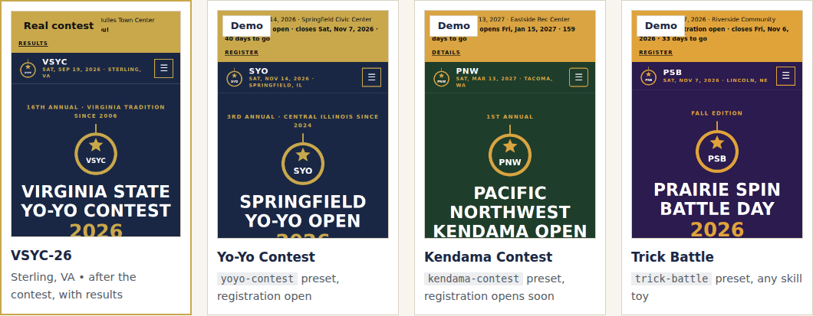

# Yo-Yo & Skill Toy Contest Website Template

A free, fast, mobile-friendly website for a **yo-yo, kendama, diabolo, or spinning top contest, a mixed
skill toy contest, or a casual trick battle**.
Edit one settings file, and GitHub builds and publishes the site for you. No coding, servers, or monthly fees.



- **Cost:** $0 on GitHub Pages. An optional custom domain is about $10–20/year.
- **Time:** about 30–60 minutes from "Use this template" to a live site, most of it gathering your contest's details.
- **Skills:** you can edit a text file in your web browser. An AI coding agent can do the whole thing (see [AGENTS.md](AGENTS.md)).
- **License:** [Unlicense](LICENSE), public domain.
- **See it first:** the [showcase and deploy guide](https://dmvthrowers.club/yoyo-contest-template/) has live examples, including the contest this template came from, the [Virginia State Yo-Yo Contest 2026](https://dmvthrowers.club/vsyc26.html).

**What you get:** 9 pages (Home, Schedule, Register, Rules, Venue, Sponsors, Results, FAQ, Terms) plus
a "page not found" page.

- **A site that follows your contest's calendar.** Set the contest date and registration dates once.
  The site rebuilds every day and switches over by itself:

  | When | Home page and top bar say | Register page |
  | --- | --- | --- |
  | Before `registration.opens` | "Registration opens Sep 15 · 74 days to go" | Opens soon |
  | Between `opens` and `closes` | "Registration open · closes Nov 7 · 40 days to go" | **Register** button |
  | After `closes` | "Registration closed · 4 days to go" | Closed |
  | Contest day | "Today! 10 AM – 6 PM" | Ask at the desk |
  | The day after | "That's a wrap · Thank you", with your wrap-up numbers | Closed, thank-you note |

  Set `contest.status` to `"postponed"` or `"cancelled"` and every page says so.
- **Divisions your way**: any number, each with its own routine length, fee, age limits, and styles
  (like X Division's 2A–5A), plus combo prices. Music upload steps appear only for divisions that use
  music; trick ladders and battles don't. Guest events get their own sign-up.
- **Rules and scoring in plain English.** The yo-yo preset explains the NYYL freestyle rules: clickers,
  normalization, the four evaluation categories, and major deductions. The other presets use typical
  formats for their toy, written so you can change them.
- **Sponsors by tier**, partners and friends, and sponsorship packages with slot counts and a funding goal.
- **Results**: a podium for each division, headline stats, and links to standings, photos, and video.
- **Venue page** with parking and food, vendor rules, venue photos, and hotel room blocks.
- **Competitor terms**: refunds, waiver, photo release, conduct, minors, and cancellation.
- **Found on Google**: the contest is a `SportsEvent` search engines understand, with your sponsors, and the FAQ shows in results.

Every page works on phones and is accessible. It's privacy-friendly (no cookies, trackers, or outside
fonts) and locked down with a strict security policy, and an automatic check catches mistakes before
they go live. The look comes from the VSYC-26 pages: navy and gold, heavy all-caps headings, square
corners, and flat cards, in your colors.

> **Running a club, not a contest?** Use the sister template,
> [yoyoclub-template](https://github.com/dmvthrowers/yoyoclub-template). They're separate on purpose:
> clubs and contests rarely share the same organizers, dates, or audience.

---

## Quick start

You need a free [GitHub account](https://github.com/signup).

### 1. Make your own copy
Click **Use this template** → **Create a new repository**. Name it (for example `springfield-open`),
keep it **Public**, and click **Create repository**.

### 2. Turn on GitHub Pages
In your new repository: **Settings → Pages → Build and deployment → Source → GitHub Actions**.

### 3. Fill in your contest
Open **`site.jsonc`**, click the **pencil icon**, and work top to bottom. Every line has a note.

1. **`preset`**: pick your kind of contest:

   | Preset | For | Comes with |
   | --- | --- | --- |
   | `yoyo-contest` (default) | A yo-yo contest | 1A, X Division, and Sport divisions; NYYL freestyle rules and scoring; music upload steps |
   | `kendama-contest` | A kendama contest | Beginner, Intermediate, and Open trick ladders, plus a battle bracket |
   | `diabolo-contest` | A diabolo contest | Single Diabolo, Multi-Diabolo styles (2D, 3D+, Vertax, fixed axle), Beginner to house music, a trick ladder; ceiling and toss safety |
   | `spintop-contest` | A spinning top contest | Trick Freestyle (string and hand-spun), Junior Tricks (12 and under), Longest Spin, Ring Battle |
   | `skill-toy-contest` | A mixed contest, several toys | One division per toy (yo-yo, kendama ladder, diabolo, spin top, open skill toy) plus Beginner for any toy |
   | `trick-battle` | A casual club battle or skill toy jam | Beginner, Open, and Kendama brackets; side games; simple battle rules |

2. **`contest`**: name, edition, date, hours, city, admission, organizer, presenting sponsor.
3. **`registration`**: when it opens and closes, your sign-up link, fees, combo prices, and the music deadline.
4. **`venue`**: name, address, parking and food, vendor rules, hotels.
5. **`sponsors`** and **`partners`**, plus prices and a goal in **`sponsorship`**.
6. **`contact`**: a shared contest email and social links.

Divisions, gear ("What to Bring"), the schedule, rules, FAQ, terms, colors, and the logo's toy come
from the preset. To change any of them, copy that section from `presets/<your preset>.json` into
`site.jsonc` and edit it there. To drop a preset section entirely, set it to `false`
(for example `"gear": false`).

> **Shortcut:** [`examples/vsyc-26.jsonc`](examples/vsyc-26.jsonc) is a complete real contest, results
> and all. Copy it over `site.jsonc` and change the details.

### 4. Watch it go live
Open the **Actions** tab. "Build and deploy" takes about a minute. When it shows a green check, your
site is live at `https://YOUR-GITHUB-NAME.github.io/YOUR-REPO-NAME/`.

**A red X** means the automatic check found a problem, such as a typo in `site.jsonc`. Click the run to
see a plain-English message. Your live site stays as it was until it's fixed.

### 5. After the contest
The day after, the home page switches to "that's a wrap" by itself. Then:

1. Fill in **`results`**: a podium for each division, a few stats, and links to the full standings,
   photos, and video.
2. Fill in **`wrap`**: the headline numbers and links for the home page.
3. Next year, change the date and registration dates, clear the results, and you're set.

---

## Preview any day

```sh
python3 build.py --serve                  # today, at http://localhost:8000/
python3 build.py --today 2026-11-14       # contest day
python3 build.py --today 2026-11-15       # the day after: "that's a wrap"
python3 scripts/check_site.py             # must print "OK"
```

The build prints the current status line, so you can check every stage before it happens.

---

## What to change (and where)

| To change… | Edit | Notes |
| --- | --- | --- |
| Name, edition, date, hours, admission | `site.jsonc` → `contest` | Two-day contest? Set `end_date`. |
| Postponed or cancelled | `site.jsonc` → `contest.status` | Every page and search engines update. |
| Registration dates, link, fees | `site.jsonc` → `registration` | The site never takes payments; it links to your form. |
| Music deadline and upload link | `site.jsonc` → `registration.music` | Steps come from the preset; copy `steps` to change them. `"music": false` hides it. |
| Combo prices | `site.jsonc` → `registration.combos` | `{ "name": "Any two divisions", "fee": "$30" }` |
| Divisions | copy `divisions` from the preset into `site.jsonc` | See [Divisions](#divisions). |
| What to bring | copy `gear` from the preset into `site.jsonc` | `title`, `intro`, `items`. |
| Guest events (battles, side contests) | `site.jsonc` → `guest_events` | Shown on Register with their own link. |
| The day's schedule | copy `schedule` from the preset into `site.jsonc` | Times are plain text, like "10:30 AM". |
| Rules and scoring | copy `rules` from the preset into `site.jsonc` | Keep the `sources` links. |
| Venue facts, rules, hotels, photos | `site.jsonc` → `venue` | Photos go in `assets/images/venue/`. |
| Sponsors and packages | `site.jsonc` → `sponsors`, `partners`, `sponsorship` | Tiers come from the preset; set prices and slots. |
| Results and wrap-up | `site.jsonc` → `results`, `wrap` | See [Competitor privacy](#competitor-privacy). |
| FAQ | `site.jsonc` → `faq_extra` | Or copy `faq` from the preset to replace it. |
| Terms | copy `terms` from the preset into `site.jsonc` | Have someone check them. See below. |
| Colors and corners | `site.jsonc` → `theme` | `"corners"`: `sharp`, `soft`, or `round`. The build warns if text would be hard to read. |
| Logo | add `assets/emblem.svg` | Otherwise a logo with your short name is generated. Pick its toy with `theme.emblem`: `yoyo`, `kendama`, `top`, `diabolo`, or `star`. |
| Social-share image | add `assets/og-card.png` (1200×630) | |
| A whole extra section on a page | `content/<page>.html` | See [content/README.md](content/README.md). |
| Page layout or new pages | `build.py` | One short function per page. |

---

## Divisions

Each preset comes with divisions. To change them, copy the whole `divisions` list from your preset
into `site.jsonc`. You can have any number. Only `name` is required:

```jsonc
"divisions": [
  { "code": "1A", "name": "1A Division", "text": "Single yo-yo on a string.",
    "length": "2-min freestyle", "fee": "$20", "music": true, "tags": ["Open"] },
  { "code": "X", "name": "X Division", "text": "Pick one style when you register.",
    "styles": [ { "code": "2A", "name": "Looping" }, { "code": "4A", "name": "Offstring" } ],
    "length": "2-min freestyle", "music": true },
  { "code": "Jr", "name": "Junior", "ages": { "max": 12 }, "length": "90-sec routine", "music": "house" },
  { "code": "KD", "name": "Kendama Ladder", "format": "Trick ladder", "music": false }
]
```

| Field | What it does |
| --- | --- |
| `code` | Short code shown big on the card, like `1A` or `KD`. Also used by `registration.fees`. |
| `name`, `text` | The division's name and a sentence or two about it. |
| `format` | Optional label: `Freestyle`, `Trick ladder`, `Bracket`, `Timed`… |
| `length` | Routine or round length, like `2-min freestyle`. Leave it out for ladders and battles. |
| `fee` | Shown on the card and, if `registration.fees` is empty, in the fee table. |
| `ages` | `"Under 13"`, or `{ "min": 8, "max": 12 }` → "Ages 8–12". Leave it out for all ages. |
| `music` | `true`: competitors send their own track. `false`: no music. `"house"`: house music, nothing to send. The Music Upload section appears only if some division uses its own music, and says which. |
| `styles` | Styles within the division. Plain codes (`["2A", "3A"]`) show as one label; `{ "code", "name", "text" }` also lists each style on the card. |
| `tags` | Any other short labels. |

**Fees.** `registration.fees` is a list of rows: `{ "name": "Spectators", "fee": "Free" }`, or
`{ "division": "1A", "fee": "$20" }` to use that division's name and show the fee on its card. Leave it
`[]` and the table lists each division's own `fee`, then `registration.combos`, then
`registration.spectators` if you set it. The build warns if a fee row names a division code that doesn't exist.

---

## Competitor privacy

- **Minors:** list competitors under 18 by first name and last initial (and state only) unless a parent
  opts in to full names. The `results.privacy_note` line explains this on the Results page.
- **Photos:** get permission for photos you post of people, and honor anyone who asks not to be shown.
  Resize photos to about 1200 pixels wide and under 500 KB, and strip location data.
- **No personal info:** don't publish home addresses, personal phone numbers, or ages of minors.
- Registration data (names, emails, payments) belongs in your sign-up tool, never in this repository.

---

## About the terms

The preset's terms are a plain-English starting point adapted from a real contest. **They are not legal
advice.** Have someone check them against your venue's requirements, your insurance, and local law,
especially the waiver and refund sections.

---

## Custom domain and other hosts

Custom domains work like any GitHub Pages site: **Settings → Pages → Custom domain**, then add the DNS
records GitHub shows you and tick **Enforce HTTPS**. The site is plain files, so Cloudflare Pages or
Netlify also work (`python3 build.py`, output folder `_site`, set `SITE_URL`). Add a daily build hook
there so the stages switch over on time.

---

## Safety and security

- No tracking, cookies, forms, or embeds, so the site collects nothing from visitors.
- A strict security policy allows only the site's own files. The check rejects inline scripts,
  insecure links, missing alt text, and broken links.
- The GitHub Actions are pinned to exact versions and kept current by Dependabot.
- Turn on two-factor login for your GitHub account.
- League, brand, and shop names in the presets are used only to describe rules and link to their
  sites. This template isn't affiliated with or endorsed by any league, brand, or shop.
- The kendama, diabolo, spin top, mixed, and battle presets describe *typical* formats, not any
  organization's official rules. Edit them to match how your contest runs.

---

## Files

```
site.jsonc              ← your contest settings (start here)
presets/                ← starting divisions, rules, schedule, FAQ, terms, sponsor tiers
  yoyo-contest.json  kendama-contest.json  diabolo-contest.json
  spintop-contest.json  skill-toy-contest.json  trick-battle.json
assets/                 ← copied to the site as-is (style.css, site.js, images/venue/)
content/                ← optional extra HTML for any page
build.py                ← builds _site/ (standard Python, no installs)
scripts/check_site.py   ← checks the built site (links, accessibility, security)
.github/workflows/deploy.yml  ← builds, checks, and publishes on every change, plus daily
AGENTS.md               ← instructions for AI coding agents
examples/               ← finished settings files (VSYC-26 plus a demo for each preset)
showcase/, scripts/build_showcase.py  ← the template's own showcase page (safe to delete in your copy)
```

Pull requests with improvements, new presets, or translations are welcome.
